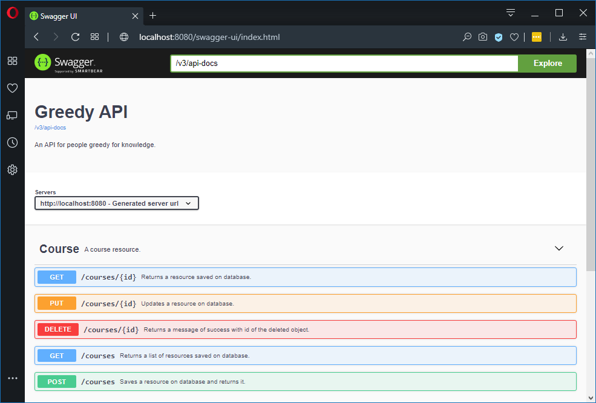

# greedy (W.I.P>)
REST API application using Hexagonal Architecture concepts.

## About the Application
 The idea of the Greedy App is a simple API where people an schools can register (presential or online) technologies courses, besides, students can create an account to know when and where interested courses will go happen. 
 Perhaps, in the future I'll develop a frontend to consumes this API.  

## The Aims
 My intent with this project is, mainly, apply some knowledgments about [**Hexagonal Architecture**](https://softwarecampament.wordpress.com/portsadapters/) obtained through reading articles on web.
 The application is a CRUD REST API developed using Java language and the Spring Framework. Inside you'll found somethings like:

- [x] Hexagonal Architecture
- [ ] S.O.L.I.D. Principles
- [x] REST API Best Practices
- [x] API Documentation with OpenAPI (Swagger)
- [x] Unit Tests with JUnit 5 and Mockito
- [x] [Test Data Builder Pattern](https://www.javacodegeeks.com/2014/06/test-data-builders-and-object-mother-another-look.html)
- [ ] Security with JWT
- [ ] Containerization with Docker

## Running the Application
You can download or clone it, then use the follow command on prompt to run the API:
`mvn spring-boot:run`

The app will be available under the follow address/port:
`http://localhost:8080`

And you can use the follow URL to see the available services:
`http://localhost:8080/swagger-ui.html`.
This link exists merely because we are using the [openapi](https://github.com/springdoc/springdoc-openapi) library.
Now, you can see in your browser something like this:
